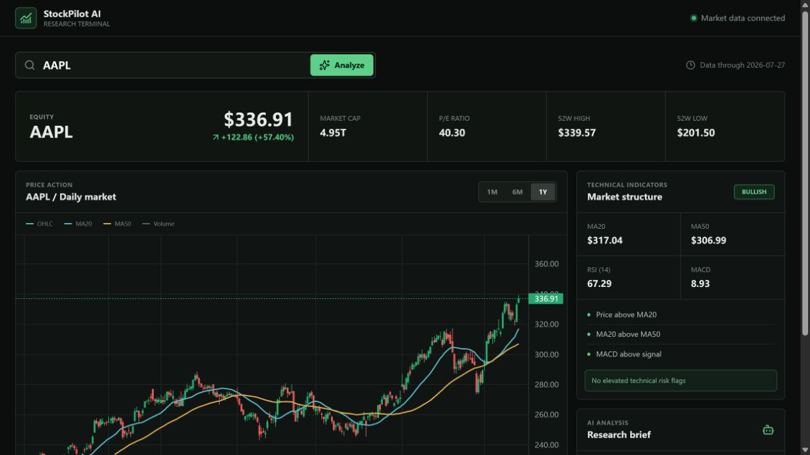
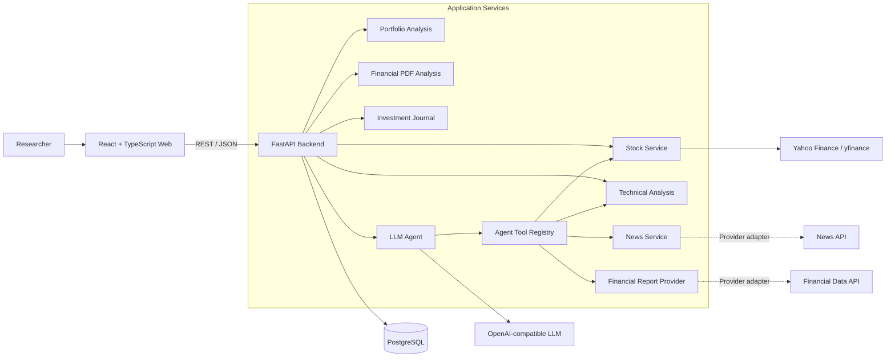

<div align="center">

# StockPilot AI

**AI-powered stock research assistant.**

Understand market data, technical signals, financial documents, and portfolio risk from one research workspace.


</div>

> StockPilot AI is a research and information tool. It does not predict prices, execute trades, or provide personalized investment advice.

## Project Introduction

StockPilot AI brings stock fundamentals, historical OHLCV data, technical analysis, portfolio analytics, financial-report extraction, and LLM-assisted research into a focused web application.

The project is designed around replaceable data and model providers. Market, news, financial-data, and OpenAI-compatible LLM integrations live behind service contracts so the core application is not tied to one vendor.

## Screenshot



## Architecture Diagram



## Features

- Stock overview with current price, market capitalization, P/E ratio, and 52-week range
- Historical open, high, low, close, and volume data powered by `yfinance`
- TradingView Lightweight Charts candlestick chart with `1M`, `6M`, and `1Y` ranges
- Pandas-based MA20, MA50, RSI, MACD, and Bollinger Bands analysis
- Portfolio concentration, volatility, correlation, and risk analysis
- LLM-assisted portfolio research through an OpenAI-compatible model endpoint
- Financial PDF analysis for revenue, profit, and risk extraction
- Persistent investment journals with AI-assisted retrospective reviews
- Provider-neutral Agent tools for stock, technical, news, and financial data
- PostgreSQL persistence with SQLAlchemy and Alembic migrations
- Docker Compose deployment with health checks and Nginx reverse proxying

The news provider, public stock-research Agent endpoint, and frontend news/AI panels are under active development. The service contracts already exist, but no live news vendor is enabled by default.

## Installation

### Docker Compose

Docker Desktop with Docker Compose v2 is the recommended way to run the complete stack.

```bash
git clone https://github.com/<your-account>/StockPilotAI.git
cd StockPilotAI
cp .env.example .env
```

Set a strong PostgreSQL password in `.env`:

```dotenv
POSTGRES_PASSWORD=replace_with_a_strong_password
```

Build and start the application:

```bash
docker compose up -d --build
docker compose ps
```

Default URLs:

- Web application: `http://localhost`
- Swagger UI: `http://localhost/docs`
- Backend health: `http://localhost:8000/api/v1/health`

Host ports can be changed with `FRONTEND_PORT`, `BACKEND_PORT`, and `POSTGRES_PORT` in `.env`. For example, set `FRONTEND_PORT=8080` when port 80 is unavailable.

### LLM Configuration

Stock data and technical analysis work without an LLM. To enable AI-backed endpoints, configure an OpenAI-compatible provider:

```dotenv
LLM_BASE_URL=https://your-provider.example/v1
LLM_MODEL=your-model-id
LLM_API_KEY=your-api-key
```

`LLM_BASE_URL` must not include `/chat/completions`; StockPilot AI appends that path automatically. The selected model must support OpenAI-compatible tool calls for Agent workflows.

Apply environment changes by recreating the backend:

```bash
docker compose up -d --force-recreate backend
```

For a non-container development setup, see the [development guide](docs/development.md). Full deployment, backup, and upgrade instructions are available in the [Docker deployment guide](docs/deployment.md).

## API Documentation

Interactive OpenAPI documentation is available at `/docs` while the application is running.

| Method | Endpoint | Description |
| --- | --- | --- |
| `GET` | `/api/v1/health` | Service health check |
| `GET` | `/api/v1/stock/{symbol}` | Stock overview and historical OHLCV data |
| `POST` | `/api/v1/portfolio/analyze` | Quantitative portfolio analysis |
| `POST` | `/api/v1/portfolio/ai-analyze` | Portfolio analysis with an LLM research summary |
| `POST` | `/api/v1/financial-documents/analyze` | Upload and analyze a financial PDF |
| `POST` | `/api/v1/investment-journals` | Create an investment journal entry |
| `GET` | `/api/v1/investment-journals/{user_id}` | List a user's journal entries |
| `POST` | `/api/v1/investment-journals/entries/{entry_id}/review` | Generate and save an AI retrospective |

Example:

```bash
curl http://localhost:8000/api/v1/stock/AAPL
```

API conventions and error formats are documented in [docs/api-conventions.md](docs/api-conventions.md).

## Project Structure

```text
StockPilotAI/
|-- frontend/              React, TypeScript, and Lightweight Charts
|-- backend/
|   |-- app/
|   |   |-- agents/        Model-driven Agent and tool registry
|   |   |-- api/           FastAPI routes
|   |   |-- db/            SQLAlchemy models and sessions
|   |   |-- integrations/  Replaceable provider contracts
|   |   `-- services/      Application and analysis services
|   `-- alembic/           PostgreSQL migrations
|-- docs/                  Architecture and operations documentation
`-- docker-compose.yml     Frontend, backend, and PostgreSQL stack
```

## Roadmap

- [x] Stock fundamentals and historical OHLCV API
- [x] Candlestick chart and technical indicators
- [x] Portfolio risk and concentration analysis
- [x] Financial PDF analysis
- [x] Investment journal persistence and AI review
- [x] Provider-neutral LLM Agent and tool registry
- [x] PostgreSQL, Alembic, and Docker deployment
- [ ] Public stock-research Agent API and frontend integration
- [ ] Live news provider adapter and news dashboard
- [ ] Financial fundamentals provider adapter
- [ ] User authentication and watchlist workflows
- [ ] Analysis-history UI and report export
- [ ] Background jobs, caching, observability, and rate limiting

## Contributing

Issues and pull requests are welcome. Keep provider-specific behavior inside `backend/app/integrations`, add focused tests for behavioral changes, and avoid presenting generated analysis as financial advice.

Before submitting a change, run:

```bash
# Frontend
npm run lint
npm run build

# Backend
ruff check .
pytest
```

## Disclaimer

StockPilot AI is provided for educational and research purposes only. Market data may be delayed or incomplete, and LLM output may contain errors. Always verify material claims against primary sources before making financial decisions.
